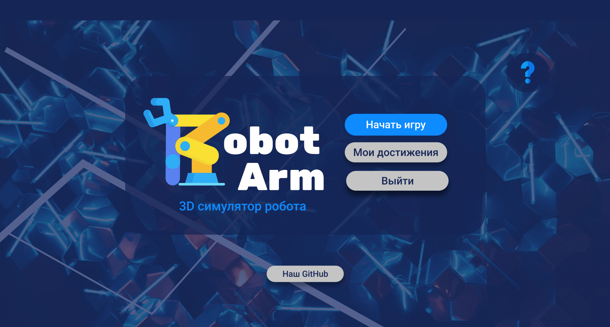
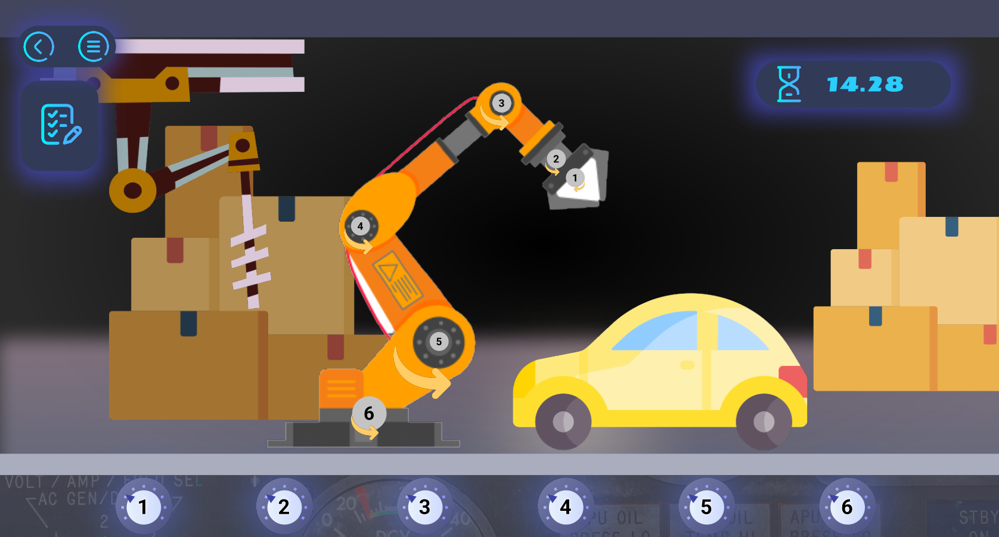
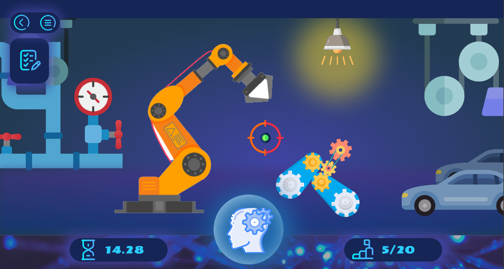

   
  
    

 

  

  

# 

Управляйте робо-рукой, чтобы помочь предприятию оптимизировать производство автомобилей. Проходите разнообразные уровни и получайте вознаграждение.  

## 
Цель проекта - в интересной форме познакомить людей с робототехникой и дать им возможность поуправлять виртуальным роботом.

## 

Через главное меню можно начать новую игру.

  

Управление роботом происходит при помощи 6 кнопок, каждая из которых отвечает за определённый сустав робо-руки.

  

Обучение робо-руки выглядит следующим образом.

  

